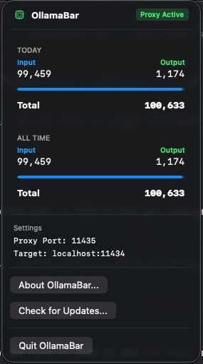

# OllamaBar

A native macOS Menu Bar application to monitor your Ollama token usage, with real-time analytics and budget enforcement.

OllamaBar acts as a local proxy for your Ollama server, intercepting requests to count tokens, track usage patterns, and enforce optional daily budgets.



## Features
- **Token Tracking** — Real-time prompt (input) and eval (output) token counts
- **Daily & All-time Stats** — Usage for today and your all-time total, with optional cost estimation
- **Token Budget Enforcer** — Set a daily token cap; soft mode warns, hard mode blocks requests with HTTP 429
- **Per-model & Per-app Breakdown** — See which models and clients (Cursor, Open-WebUI, curl) are burning tokens
- **Predictive Burn Rate** — Projects your end-of-day total based on current pace
- **91-day Usage Heatmap** — GitHub-style contribution grid of your token history
- **Token Efficiency Score** — Rates how efficiently you're prompting (Verbose / Balanced / Tight / Ultra-efficient)

## Installation
1. Download the [latest release](https://github.com/hansraj316/OllamaBar/releases) (OllamaBar.zip)
2. Unzip and move `OllamaBar.app` to your `/Applications` folder
3. Open `OllamaBar.app` — a server icon appears in your Menu Bar

## Usage
Change your Ollama client's API URL to the OllamaBar proxy port:
- **Direct Ollama:** `http://127.0.0.1:11434`
- **OllamaBar Proxy:** `http://127.0.0.1:11435`

Works with Cursor, Open-WebUI, Cline, curl, or any HTTP client.

## Development

Requirements: Xcode 15+, macOS 14+

```bash
# Build
xcodebuild -scheme OllamaBar -configuration Debug build

# Run tests
xcodebuild test -scheme OllamaBar -destination 'platform=macOS,arch=arm64'

# Run a single test class
xcodebuild test -scheme OllamaBar -destination 'platform=macOS,arch=arm64' \
  -only-testing:OllamaBarTests/UsageStoreTests
```

## License
MIT
