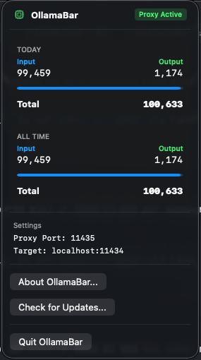

# OllamaBar

> A macOS menu bar app that watches your local Ollama: live token counts, budgets, model status, and a floating gauge strip. It sits between your tools and Ollama as a transparent streaming proxy.

[](https://github.com/hansraj316/OllamaBar/actions/workflows/swift.yml)
[](https://github.com/hansraj316/OllamaBar/releases/latest)
[](https://github.com/hansraj316/mission-control-openclaw)
[](https://github.com/hansraj316/OllamaBar)



## How it works

Point any Ollama client at `http://127.0.0.1:11435` instead of `11434`. OllamaBar forwards each request to Ollama unchanged, streams the answer back as it is generated, and reads the token counts off the final chunk. Nothing leaves your machine.

```
Cursor / Open WebUI / curl ──▶ OllamaBar :11435 ──▶ Ollama :11434
                                  │
                                  └─ counts tokens, latency, budget
```

## What's new in 3.0

- **Real streaming proxy.** Tokens reach your client as Ollama produces them. Every method and path passes through, including the OpenAI-compatible `/v1` API, so model pickers and pulls keep working.
- **Four tabs.** Overview, Models, Activity, Settings replace the single scrolling list.
- **Models tab.** See what is loaded in memory, how much sits on the GPU, when it unloads, and evict it with one click.
- **Edge gauges.** An optional floating strip on the screen edge with ring gauges for your budget and each app's share of today's tokens.
- **Ink look.** Always-dark surface, one bright accent per bar with a "resets at" note, rings and bars that turn from mint to lime to hot as usage fills.

Full list in [CHANGELOG.md](CHANGELOG.md).

## Features

**Proxy**
- Transparent streaming proxy, any method and path, upstream status codes preserved.
- Token counting from native `/api/generate` and `/api/chat` chunks and from OpenAI-compatible `usage` objects (SSE or JSON).
- Per-request duration, tokens per second, and average latency.
- Daily token budget. *Warn* changes the menu bar colour. *Block* answers generation requests with HTTP 429 while model listing and pulling keep working.

**Overview**
- Today's total with input/output split, change vs yesterday, requests, and optional cost estimate.
- Daily budget bar with reset time, rolling last-hour bar, burn rate, projected end-of-day total, efficiency score, average speed.
- 14-day stacked trend chart.
- Breakdown by model or client app for Today, 7 days, 30 days, or all time.
- 91-day heatmap with active days, streak, and peak day.

**Models**
- Ollama online/offline and version, refreshed every 20 seconds.
- Loaded models with GPU share, size, and unload countdown, plus **Unload**.
- Installed models with size, parameters, quantisation, and all-time tokens.

**Activity**
- The last 60 requests with model, app, endpoint, tokens, duration, and tok/s.
- Recognises Cursor, Open WebUI, Cline, Continue, Zed, Aider, Raycast, the Ollama CLI, OpenAI SDKs, curl, Python, Node, Go, and more.

**App**
- Edge gauges strip, launch at login, budget notifications at 80% and 100%, CSV/JSON export, settings that apply without relaunching.

## Installation

1. Download `OllamaBar.zip` from the [latest release](https://github.com/hansraj316/OllamaBar/releases/latest).
2. Unzip and move `OllamaBar.app` to `/Applications`.
3. The app is ad-hoc signed, not notarised, so macOS will refuse to open it once. Clear the quarantine flag:
   ```bash
   xattr -cr /Applications/OllamaBar.app
   ```
4. Open `OllamaBar.app`. A waveform icon appears in the menu bar.

Requires macOS 14 or later and a running Ollama (`ollama serve`).

## Usage

Change your client's Ollama URL from `http://127.0.0.1:11434` to `http://127.0.0.1:11435`. For OpenAI-compatible clients, use `http://127.0.0.1:11435/v1`.

```bash
# Native API
curl http://127.0.0.1:11435/api/chat \
  -d '{"model":"llama3.2","messages":[{"role":"user","content":"hi"}]}'

# OpenAI-compatible API (counted too)
curl http://127.0.0.1:11435/v1/chat/completions \
  -d '{"model":"llama3.2","messages":[{"role":"user","content":"hi"}],"stream":true,"stream_options":{"include_usage":true}}'

# Management endpoints pass straight through
curl http://127.0.0.1:11435/api/tags
```

**Budget.** Settings → Budget. Set a daily cap in tokens and choose *Warn* or *Block*. Turn on notifications to get a system alert at 80% and 100%.

**Edge gauges.** Settings → General → Edge gauges. A black strip appears on the right edge of the screen. The top ring is today's budget; the rings below are each app's share of today's tokens. Drag it anywhere.

**Export.** Settings → Data → Export CSV or JSON. Usage lives in `~/Library/Application Support/OllamaBar/`.

## Development

Requirements: Xcode 16+, macOS 14+, [xcodegen](https://github.com/yonaskolb/XcodeGen).

```bash
# Generate the Xcode project
xcodegen generate

# Build
xcodebuild -scheme OllamaBar -configuration Debug build

# Run tests
xcodebuild test -scheme OllamaBar -destination 'platform=macOS,arch=arm64'

# Run a single test class
xcodebuild test -scheme OllamaBar -destination 'platform=macOS,arch=arm64' \
  -only-testing:OllamaBarTests/UsageStoreTests
```

Architecture notes live in [CLAUDE.md](CLAUDE.md).

### Releasing

Push a version tag and the [Release workflow](.github/workflows/release.yml) builds the app on a macOS runner, ad-hoc signs it, zips it, and publishes a GitHub Release with the matching `CHANGELOG.md` section as notes.

```bash
git tag v3.0.0
git push origin v3.0.0
```

## The Mission

OllamaBar is an observability pillar of the **Indian Avengers** organisation. It provides the **Token Efficiency & Budget Enforcement** required to scale a multi-agent "GitHub Factory" toward the **$1,000,000 revenue goal**. Every agent, from **Anusandhan (The Sentinel)** to **Parmanu (Engineering Commander)**, uses OllamaBar to keep token usage optimised and operational costs locked.

## Claude Code / OpenClaw Integration

OllamaBar pairs with the [Mission Control dashboard](https://github.com/hansraj316/mission-control-openclaw) for full-stack observability across the Indian Avengers org:

- **OllamaBar** monitors local Ollama LLM usage (token budget, per-model breakdown, model residency).
- **Mission Control** monitors the 25-agent org (cron jobs, agent activity, security telemetry).

Agents running via OpenClaw that use local models (Aditya, Dhruva) route through `http://127.0.0.1:11435` for token tracking.

## License

MIT
